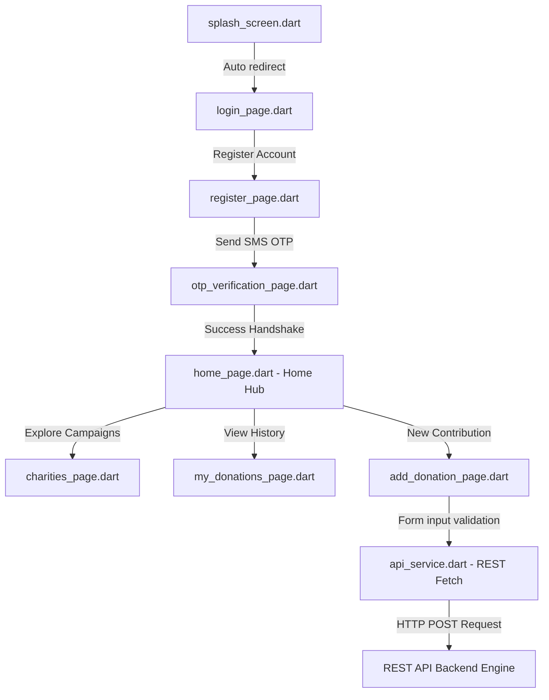

# Ataa Care Flutter: Interactive Mobile Donation Client

<div align="center">
  
</div>

<div align="center">
      
</div>

تطبيق **عطاء للهاتف المحمول** هو واجهة مستخدم تفاعلية متكاملة مبنية باستخدام Flutter لتمكين المتبرعين من استعراض الجمعيات الخيرية والمشاركة في حملات التبرع، بالإضافة إلى لوحات تحكم لإدارة ومتابعة المدفوعات والتقارير.

This repository houses the cross-platform Flutter mobile client for the **Ataa Smart Charity Ecosystem**. Built using Dart to provide a seamless, high-performance donation workflow for Android and iOS devices.

---

## 🧬 Mobile App Pages & User Flows

The mobile client defines clean navigation states and pages:

1.  **Onboarding & Auth**:
    *   `splash_screen.dart`: Gateway screen displaying the system onboarding animation.
    *   `login_page.dart` / `register_page.dart`: Authentication portals connecting to the Express API.
    *   `otp_verification_page.dart` / `ForgetpasswordPage.dart` / `ResetPasswordpage.dart`: Secure identity verification and access recovery flows.
2.  **Donor Hub**:
    *   `home_page.dart`: Main hub listing active campaigns, system statistics, and shortcuts.
    *   `charities_page.dart`: Interactive listing page for registered non-profit organizations.
    *   `donations_list_page.dart` / `my_donations_page.dart`: Lists tracking transaction history and personal campaign contributions.
    *   `add_donation_page.dart`: Multi-step wizard form to submit new campaign contributions.
3.  **Management & Settings**:
    *   `admin_dashboard.dart` / `charity_dashboard.dart`: Dashboard components for platform managers and charities.
    *   `profile_page.dart` / `notifications_page.dart` / `about_page.dart`: Personal profile setups, real-time alert updates, and platform information.

---

## 🧬 Client UI Navigation Flow

The mobile screens coordinate transitions and API integrations:



---

## 🛠️ Technology Stack & Assets

*   **Framework**: **Flutter v3.x** for native cross-platform compile.
*   **Language**: **Dart v3.x** strict type safety.
*   **Networking**: Asynchronous REST client wrapper (`api_service.dart`) utilizing HTTP requests.

---

## 📂 Repository Module Layout

```text
Ataa-Care-Flutter/
├── android/             # Native Android build configurations
├── ios/                 # Native iOS build configurations
├── lib/
│   ├── PAGES/           # Screen views (Home, Login, Dashboard, Schedulers)
│   ├── api_service.dart # HTTP client wrapper executing API fetches
│   └── main.dart        # Flutter entry initializer
├── assets/              # Branding graphics and local assets
├── pubspec.yaml         # Flutter packages dependencies manifest
└── README.md            # System documentation
```

---

## ⚡ Local Setup & Run

### 📋 Prerequisites
* Flutter SDK (v3.0+) and Dart SDK installed
* Android Studio / Xcode configured for emulators

### ⚙️ Quick Start Steps
```bash
# 1. Clone the mobile repository
git clone https://github.com/Ataa-Charity-Viewer-Team/Ataa-Care-Flutter.git
cd Ataa-Care-Flutter

# 2. Install dependencies
flutter pub get

# 3. Configure API Service
# Set target backend API URL in lib/api_service.dart

# 4. Run on Emulator / Connected Device
flutter run
```

---

## 📄 License
Licensed under the **MIT License**.
